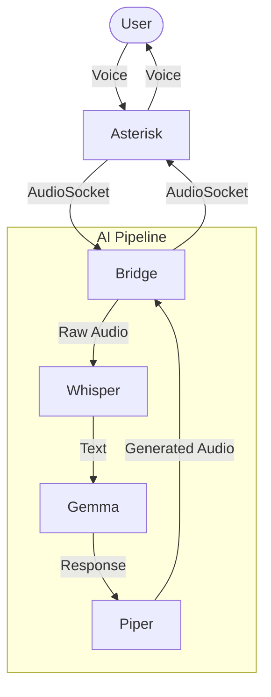

# Gemma 4 Voice Calling Agent

A real-time, low-latency AI voice agent that connects Asterisk (telephony) to the Gemma 4 LLM.

## System Architecture



### Components (One-Word Explanation)
*   **User**: Caller
*   **Asterisk**: Telephony
*   **Bridge**: Controller
*   **Whisper**: Listener
*   **Gemma**: Thinker
*   **Piper**: Speaker

## How it Works

1.  **Telephony**: Asterisk receives an incoming call and routes audio to the Bridge via TCP (AudioSocket).
2.  **STT (Listener)**: The Bridge uses `faster-whisper` (base model) to transcribe speech to text locally on the CPU.
3.  **LLM (Thinker)**: The text is sent to the Gemma 4 `server.py`, which generates a conversational response.
4.  **TTS (Speaker)**: The response is converted back to audio using `Piper TTS` (~50ms latency), ensuring a natural flow.
5.  **Streaming**: The audio is streamed back through Asterisk to the caller.

## Getting Started

### 1. Requirements
*   Python 3.11+
*   WSL2 (for Asterisk and Bridge)
*   `faster-whisper`, `piper-tts`, `httpx`

### 2. Start Services
To start the entire stack (LLM Server, Asterisk, and the Bridge), run:
```powershell
python start_all.py
```

## Logs
*   `server.log`: Gemma 4 API server output.
*   `bridge.log`: Asterisk-to-AI bridge logic and transcriptions.
