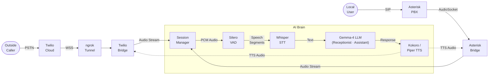
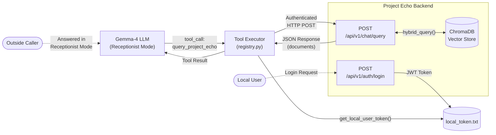

# Gemma Voice Assistant — System Architecture

> Three-tier architecture: **Voice Layer → AI Brain → API & Data**

---

## 📞 Voice Pipeline (Forward + Return)

---

## 🗄️ Data & Authentication Flow (Tool Calling)

---

## Key

| Line Style | Meaning |
|---|---|
| **Solid →** | Primary data flow (forward pipeline) |
| **Dotted -.->** | Return path / secondary flow (TTS audio, auth, identity) |

| Color | Component |
|---|---|
| 🟢 Green border | Users (Outside Caller, Local User) |
| 🔵 Blue fill | Voice infrastructure (Twilio, Asterisk, Bridges) |
| 🟣 Purple fill | AI processing (Session, Whisper, Gemma, Kokoro) |
| 🔴 Red fill | VAD gate / Databases (PostgreSQL, ChromaDB) |
| 🟠 Orange fill | Data layer (Tool Executor, APIs, Token) |

---

## System Capabilities

| | Capability | Description |
|---|---|---|
| 🎭 | **Dual Persona** | Receptionist & Assistant are modes of the same LLM, selected by caller identity |
| 🔇 | **Barge-in** | User can interrupt AI mid-speech — TTS playback cancels instantly on speech detection |
| 🔍 | **Identity Resolution** | Direct `asyncpg` queries to PostgreSQL (`linked_spaces` → `users`), runs in parallel during greeting |
| 📝 | **Post-Call Processing** | Async pipeline after hangup — Gemma summarizes transcript + sentiment analysis → stored to SQLite |
| 🌐 | **REST API** | FastAPI exposes `/v1/chat/completions`, `/chat-audio`, `/health` alongside voice bridges |
| 🛠️ | **Tool Calling** | LLM invokes registered tools (`query_project_echo`, `get_order_status`, `send_sms`) via `registry.py` |
