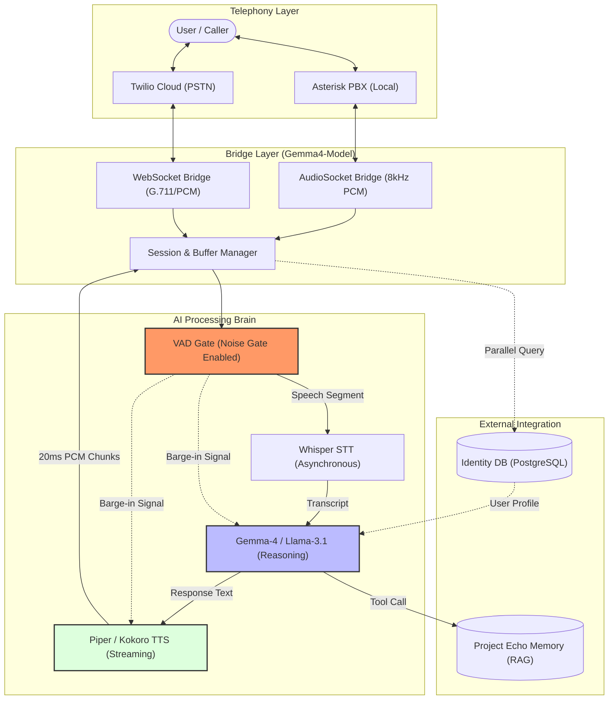

# Methodology Addition: Gemma4-Model (Calling Agent)

This document contains the technical details and architecture for the **Calling Agent** integration, designed to be added to the Project Echo proposal methodology (Chapter 3).

---

## 3.3. Gemma4-Model: Voice-Centric Telephony Integration
The Gemma4-Model serves as the specialized "Calling Agent" layer, bridging traditional telephony infrastructure with the Project Echo AI brain. This component facilitates real-time, low-latency voice interactions, enabling the system to function as either an autonomous receptionist or a personal voice assistant.

### 3.3.1. Calling Agent Architecture
To support real-time voice interaction, the methodology employs a multi-layered architectural pipeline. This ensures that audio data is processed, understood, and responded to with minimal latency while maintaining the ability to handle user interruptions (barge-in).

#### Figure 3.3: Architectural Pipeline of the Calling Agent

### 3.3.2. Unified Telephony Bridge Architecture
The system employs a unified bridge architecture to standardize audio data from disparate sources into a cohesive processing stream:
*   **AudioSocket Protocol**: For local PBX integration (Asterisk), the system implements an `AudioSocketBridge` that streams 16-bit, 8kHz PCM audio frames over TCP.
*   **Twilio WebSocket Integration**: For cloud-based telephony, a parallel bridge consumes bidirectional media streams via WebSockets (WSS).
*   **Centralized Session Management**: Both bridges interface with a shared `Session` manager, which handles state persistence and coordinates concurrent AI tasks.

### 3.3.3. Real-Time Multimodal Pipeline
The voice pipeline is optimized for real-time performance through a series of specialized adapters:
*   **Enhanced VAD with Noise Gating**: Utilizing a Silero-based `VADAdapter`, the system implements an energy-based noise gate to filter out ambient noise and prevent false-positive barge-ins.
*   **Asynchronous STT & TTS**: Speech-to-Text and Text-to-Speech operations are executed in non-blocking asynchronous tasks to ensure the telephony loop remains responsive.
*   **20ms Audio Chunking**: Synthesized speech is streamed in 20ms chunks, allowing for near-instant playback cancellation upon user interruption.

### 3.3.4. Latency Mitigation & Conversational UX
*   **Pre-Synthesized Greetings**: The initial greeting is pre-synthesized and cached to eliminate startup delay.
*   **Parallel Identity Resolution**: Caller profiles are resolved from the Identity DB in parallel with the initial greeting.
*   **LLM Bypass Logic**: For identity-related queries, the agent can bypass the LLM inference entirely if the data is available in the session cache.
*   **Intelligent Barge-In**: The system monitors VAD during AI speech to immediately cancel the TTS and LLM tasks when the user speaks.

### 3.3.5. Identity-Driven Dynamic Personas
The calling agent dynamically adjusts its behavior based on the resolved identity:
*   **Receptionist Mode**: Activated for guest callers; focuses on business offerings using the `query_project_echo` RAG tool.
*   **Personal Assistant Mode**: Activated for recognized owners; allows authenticated access to personal tools and maintaining a familiar tone.
